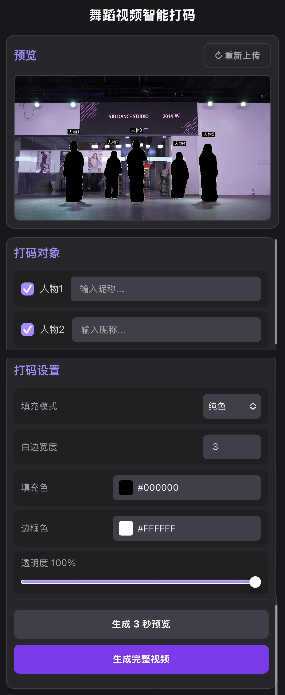

# 多人舞蹈视频智能打码

上传舞蹈视频 → 勾选人物 → 按需调整参数 → 一键生成打码。AI 自动追踪全身，快速动作也不会漏。




---

## 运行脚本快速开始

### Mac

打开「终端」，依次复制粘贴以下命令（建议关闭 VPN）：

```bash
cd 这里把项目文件夹拖进来
bash scripts/mac/setup.sh
bash scripts/mac/run.sh
```

浏览器打开 `http://localhost:8002`。

### Windows

**进入 `scripts/windows/` 文件夹：先双击 `setup.bat`， 然后双击 `run.bat`。**（建议关闭 VPN）
完成后浏览器打开 `http://localhost:8002`。

> **注意**：没有 NVIDIA 显卡的电脑（纯 CPU 模式）第一次处理视频时初始化较慢，可能需等待 5-10 分钟，不是卡死了。如果报错，再点一次即可正常运行。

---

## ？脚本执行不了怎么办

跟着下面步骤走，**全程复制粘贴**，轻松搞定。

---

## 第一步：一键安装

### Mac 用户

打开「终端」，把下面三行一行一行复制进去，每行按回车：

```bash
cd 文件夹路径
```

```bash
python3 -m venv .venv
source .venv/bin/activate
pip install -r requirements.txt
```

看到 `Successfully installed ...` 就说明装好了。

### Windows 用户

按 `Win+R`，输入 `cmd`，回车。在黑窗口里**一行一行**复制，每行按回车：

```bash
cd 文件夹路径
```

```bash
python -m venv .venv
.venv\Scripts\activate
pip install -r requirements.txt
```

---

## 第二步：启动

**每次使用都要先做这一步**。

### Mac

```bash
cd 文件夹路径
source .venv/bin/activate
uvicorn api:app --host 0.0.0.0 --port 8002
```

### Windows

```bash
cd 文件夹路径
.venv\Scripts\activate
uvicorn api:app --host 0.0.0.0 --port 8002
```

看到 `Uvicorn running on http://0.0.0.0:8002` 就说明启动成功了。

---

## 第三步：打开网页

浏览器地址栏输入：**`http://localhost:8002`**，回车。

? **手机也能用**：手机和电脑连同一个 WiFi，手机浏览器输入 `http://电脑IP:8002`。  
（Mac：系统设置 → 网络 → 看 IP 地址。Windows：`Win+R` → `cmd` → `ipconfig` → 找 IPv4 地址）

---

## 怎么用

1. 点「上传并分析」，选一个舞蹈视频
2. 勾选你要打码的人（默认全选）
3. 调颜色、白边、透明度（实时预览）
4. 可以点「生成 3 秒预览」先试一下效果
5. 满意就点「生成完整视频」，等着就行
6. 完成后点「下载视频」

---
## 可能遇到的问题

### ? 网页打不开 / 显示「无法连接」

1. 确认黑窗口还开着（关掉窗口服务就停了）
2. 确认黑窗口里最后一行是 `Uvicorn running on ...`
3. 确认网址写的是 `http://localhost:8002`（不是 https）

### ? 提示 `address already in use`（端口被占用）

说明之前已经启动过一个服务，关掉重开：

Mac：
```bash
lsof -ti:8002 | xargs kill -9
bash scripts/mac/run.sh
```
Windows：关掉所有黑窗口，重新双击 `run.bat`。

### ? 处理一半报错了 / 卡住了

刷新网页，上传视频重新来一次。大概率是显存不够，尝试处理短一点的视频。

### ? 手机上访问不了

1. 确认手机和电脑连的是**同一个 WiFi**
2. 确认网址格式是 `http://IP:8002`（不是 localhost）
3. Mac 防火墙关了试试：系统设置 → 网络 → 防火墙 → 关闭

### ? 处理速度很慢

实测数据参考：

| 设备 | 视频时长 | 处理耗时 |
|------|---------|---------|
| Mac (Apple M 芯片 GPU) | 25 秒 | ~160 秒 |
| Windows (纯 CPU) | 10 秒 | ~400 秒 |

有 NVIDIA 显卡可大幅加速。

---

## 命令行快速启动

Mac：
```bash
git clone https://github.com/Corgiac/dance-anonymizer.git
cd dance-anonymizer
python3 -m venv .venv && source .venv/bin/activate
pip install -r requirements.txt
uvicorn api:app --host 0.0.0.0 --port 8002
```

Windows：
```bash
git clone https://github.com/Corgiac/dance-anonymizer.git
cd dance-anonymizer
python -m venv .venv && .venv\Scripts\activate
pip install -r requirements.txt
uvicorn api:app --host 0.0.0.0 --port 8002
```
