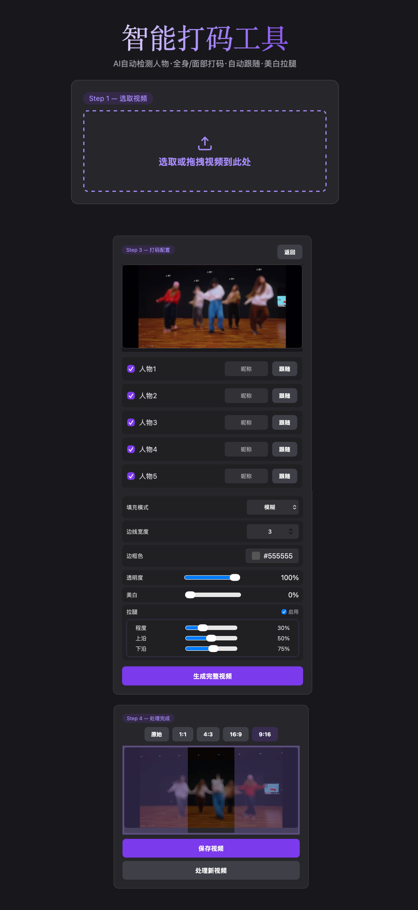

# DanceAnon — AI 智能舞蹈视频打码工具

上传视频自动识别追踪人物，支持全身打码、面部贴纸、美白拉腿、自动跟随运镜，Web 界面实时预览并导出。



## 系统要求

- Python 3.10+
- 内存 8GB+
- macOS / Windows / Linux
- 显卡：Apple M 系列 / NVIDIA（GPU 加速），纯 CPU 也可运行

## 快速开始

### 1. 安装 Python

Python 版本需 ≥ 3.10。已安装的可跳过。

**Mac**：`brew install python@3.11`，或访问 [python.org](https://www.python.org/downloads/) 下载。

**Windows**：访问 [python.org](https://www.python.org/downloads/) 下载安装包，**安装时勾选「Add Python to PATH」**。

### 2. 下载项目

点击页面右上角 `Code` → `Download ZIP`，解压到任意文件夹。

> ⚠️ 还需下载模型文件 [sam2_hiera_tiny.pt](https://dl.fbaipublicfiles.com/segment_anything_2/072824/sam2_hiera_tiny.pt)（约 150MB），放到项目根目录。

### 3. 安装环境

**Mac**：打开终端，把文件夹拖进去，运行：

```bash
cd 文件夹路径
bash scripts/mac/setup.sh
```

**Windows**：进入 `scripts/windows/`，双击 `setup.bat`。

### 4. 启动

**Mac**：终端运行 `bash scripts/mac/run.sh`

**Windows**：双击 `scripts/windows/run.bat`

浏览器打开 **http://localhost:8002**

> 📱 手机和电脑同 WiFi 下，手机浏览器访问 `http://电脑IP:8002` 也能用。

## 使用说明

1. **选择视频** → 拖动裁剪条选取片段 → 上传分析
2. **勾选人物**（默认全选）
3. **调节参数**：填充模式、颜色、透明度、美白、拉腿
4. **面部贴纸**（可选）：取消勾选 → 点亮「面部」→ 选贴纸
5. **自动跟随**（可选）：点「跟随」按钮 → 镜头跟随该人物
6. **生成视频** → 等待完成 → 可选裁剪画幅 → 下载

> 需要打码的人必须在首帧画面内，否则 AI 无法追踪。人物建议控制在 8 人以内。

## 常见问题

**安装报错 / Python 版本太低**：需要 Python 3.10+。国内用户遇到网络问题先关掉 VPN/代理，脚本会自动换镜像重试。

**网页打不开**：确认终端窗口开着，地址是 `http://localhost:8002`（非 https）。

**端口被占用**：
- Mac：`lsof -ti:8002 | xargs kill -9` 后重新运行 run.sh
- Windows：关掉所有命令行窗口后重新双击 run.bat

**生成的视频没声音**：iPhone 拍摄的视频需安装 ffmpeg。Mac 运行 `brew install ffmpeg`，Windows 从 [ffmpeg.org](https://ffmpeg.org) 下载。

## 模型说明

| 模型 | 用途 | 获取方式 |
|------|------|----------|
| yolo11s-seg.pt | 人物检测 | 项目自带 |
| sam2_hiera_tiny.pt | 首帧 mask 精修 | [下载](https://dl.fbaipublicfiles.com/segment_anything_2/072824/sam2_hiera_tiny.pt) |
| vendor/Cutie/weights/ | CUTIE 人物追踪 | 项目自带 |

## 技术栈

Python · FastAPI · OpenCV · YOLO · CUTIE · SAM2 · PyTorch
